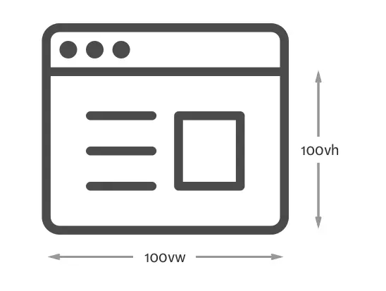

#基于视口单位的网页排版#

基于视口单位的网页排版是移动端布局的一种，在深入介绍视口单位以及其在网页排版中的工作原理时，先了解下有哪些常见的视口单位。

###视口单位是什么？###

在 CSS 规范中，有4种类型的可用视口单位：

* vw — 1vw 等于视口宽度的 1%
* vh — 1vh 等于视口高度的 1%
* vmin — vw 和 vh 中的较小值
* vmax — vw 和 vh 中的较大值

视口，即浏览器屏幕大小，1vw 等于浏览器宽度的 1%，100vw 即整个浏览器的宽度。

视口的单位大小会根据视口大小的改变自动计算，视口大小的改变常发生于页面加载、页面缩放或者屏幕方向的改变(横纵切换)。正因为如此，创建一个大小总为视口四分之一大小的容器是非常容易滴：
		
	.component {
	  width: 50vw;
	  height: 50vh;
	  background: rgba(255, 0, 0, 0.25)
	}

###将视口单位用于网页排版###

将视口单位用于网页排版的唯一理由就是视口的单位大小会根据客户端浏览器的视口大小自动计算。也就是说，我们不必明确地通过媒体查询来声明字体大小。举个demo来简要说明一下。

代码如下，将断点设置为 800px，字体大小从 16px 变为 20px：

	html{
		font-size:16px;
	}
	@media and screen (min-width:800px){
		font-size:20px;		
	}
对于上述代码，当视口大小是 800px 时，字体会从 16px 突变 到 20px。在响应式排版中，这是经常采用的方式。但是，如何不用媒体查询或字体大小的设置来达到同样的效果呢？这就是视口单位的用处了。你可以用视口单位来表示字体大小：

	html { font-size: 3vw; }

是不是很棒？一段简短的代码就实现了适配。但也有明显的缺点，就是视口的单位大小是根据设备屏幕的视口大小计算的，对于小屏幕设备(如宽度 320px 的手机)，字体太小，难以阅读；对于大屏幕设备(如宽度 1440px 的笔记本)，字体会变的非常大，同样也会难以阅读。

所以，现在面临的一个有意思的挑战是—怎么解决不同设备的视口宽度对视口单位计算的影响？一种简单地方式是设置 font-size 的最小值，然后通过 calc() 属性来动态计算小屏幕设备上的字体大小值：

	html { font-size: calc(18px + 0.25vw) }

但是，不是所有的浏览器都支持 calc() 的这种计算方式(px+vw)。解决方式也很简单，结合使用百分比和 vw 用于 calc 计算能获得更好地浏览器支持：

	html { font-size: calc(112.5% + 0.25vw) }

用视口单位设置其它排版元素的字体大小。首先，我创建一个h1元素，将其字体大小设置为body 的两倍：

	html { font-size: calc(112.5% + 0.25vw) }
	h1 { font-size: calc((112.5% + 0.25vw) * 2); }
我试图将 html 元素的字体大小乘以2，但并不可行，对于 h1，字体大小是基于百分比计算的。在字体大小继承了html的大小之后，又重新计算了h1的字体大小。

**现在假设视口宽度是 800px，默认的 font-size 是 16px.**

此时，112.5%*16px=18px；0.25vw=0.25%*800px=2px；所以html最终字体大小为：18px+2px=20px;由于h1继承了html的字体大小，所以此时112.5%*20px=22.5px；0.25vw=0.25%*800px=2px；22.5px+2px=24.5px;即h1最终字体大小为：24.5px*2=49px；

这与最初想把 h1 元素的 font-size 设置成 Body 的两倍大小的想法相违背。但我们知道了造成差异的原因是由于 h1 继承了 html 的 font-size，还下面的方式来解决这个问题。

	html { font-size: calc(112.5% + 0.25vw) }
	h1 { font-size: 2em; }
**那么，如何才能字体大小更加精确？**

假设你要处理下面两种情况：

* 视口宽度是 600px 时，font-size 是 18px
* 视口宽度是 1000px 时，font-size 是 20px

首先，我们必须将较小的 font-size 值转为百分比。

第一步计算是：calc(18/16 * 100%) (或者 calc(112.5%))。接下来，计算出 vw 值。这部分的计算略繁琐:

* 计算 font-size 的最大差值 v1(22-18=4)
* 用 v1 除以视口宽度的最大差值 v2(1000-600)
* 将上述结果再乘以 100vw – smaller-viewport-width(100vw – 600)

最终，结果如下：

	html {
  		font-size: calc(112.5% + 4 / 400 * (100vw - 600px) )
	}